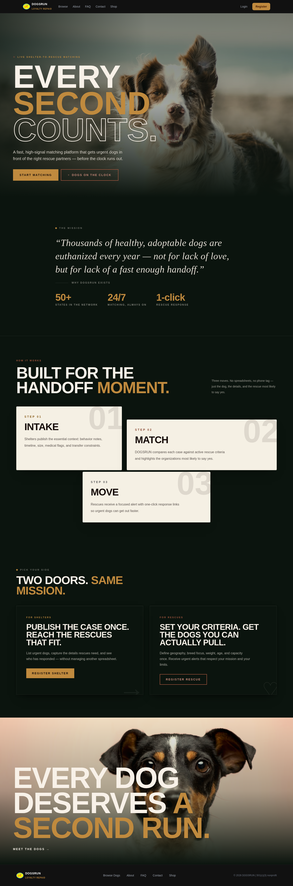
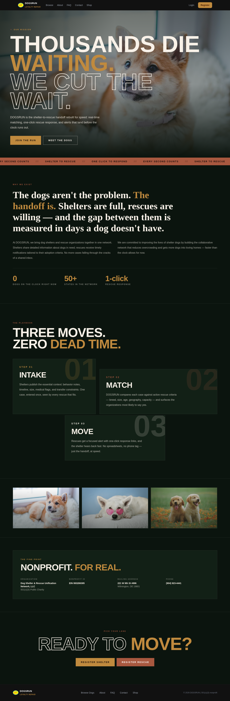

# DOGSRUN

**Every second counts.** A shelter-to-rescue dog matching platform that gets urgent dogs in front of the right rescue partners — before the clock runs out.

Shelters list dogs on intake. DOGSRUN automatically matches them against rescue organizations' criteria and fires instant email alerts. Rescues respond with one click. No spreadsheets, no phone tag — just the handoff, at speed.

**Live:** https://dogsrun.org

## Screenshots





## Tech Stack

| Layer | Tool |
|---|---|
| Framework | Next.js 16 (App Router) |
| UI | React 19, TypeScript, Tailwind CSS 4 |
| Database + Auth | Supabase (PostgreSQL, Row Level Security, Auth, Storage) |
| Email | Resend |
| Rate Limiting | Upstash Redis |
| Monitoring | Sentry (client, server, edge) |
| Hosting | Vercel |
| Testing | Vitest (unit), Playwright (e2e) |

## Getting Started

### Prerequisites

- Node.js 20+
- A Supabase project
- Resend API key (for email alerts)
- Upstash Redis (optional locally — rate limiting degrades gracefully)

### Setup

```bash
# Install dependencies
npm install

# Copy env template and fill in real values
cp .env.example .env.local

# Run the dev server
npm run dev
# → http://localhost:3000
```

See [CONTRIBUTING.md](./CONTRIBUTING.md) for the full development workflow, branching conventions, and code review process.

### Environment Variables

| Variable | Required | Description |
|---|---|---|
| `NEXT_PUBLIC_SUPABASE_URL` | Yes | Supabase project URL |
| `NEXT_PUBLIC_SUPABASE_ANON_KEY` | Yes | Supabase anonymous key |
| `SUPABASE_SERVICE_ROLE_KEY` | Yes | Supabase service role key (server-side only) |
| `RESEND_API_KEY` | Yes | Resend API key for alert emails |
| `UPSTASH_REDIS_REST_URL` | No | Upstash Redis URL (rate limiting) |
| `UPSTASH_REDIS_REST_TOKEN` | No | Upstash Redis token |
| `NEXT_PUBLIC_SENTRY_DSN` | Prod | Sentry DSN |
| `SENTRY_ORG` / `SENTRY_PROJECT` / `SENTRY_AUTH_TOKEN` | Prod | Sentry source map upload |

## Project Structure

```
src/
├── app/
│   ├── (public)/       # Marketing pages: home, about, faq, contact, browse
│   ├── dashboard/      # Shelter + rescue portals (authenticated)
│   ├── admin/          # Admin panel (admins only)
│   ├── api/            # API routes: alerts, matching, auth, admin
│   └── auth/           # Login, register, password reset
├── components/
│   ├── ui/             # Shared UI primitives (buttons, cards, dialogs)
│   └── ...             # Feature components (navbar, dog cards, forms)
├── lib/
│   ├── matching.ts     # Core rescue-matching engine
│   ├── urgency.ts      # Euthanasia countdown + urgency helpers
│   ├── email.ts        # Resend templates
│   ├── ratelimit.ts    # Upstash-backed rate limiting
│   └── supabaseAdmin.ts # Privileged Supabase client
tests/
├── e2e.spec.ts         # Playwright end-to-end suite
└── api-security.spec.ts # API security tests
```

## How It Works

1. **Intake** — Shelters publish the essential context: behavior notes, timeline, size, medical flags, transfer constraints.
2. **Match** — DOGSRUN compares each case against active rescue criteria (breed, size, age, geography, capacity) and surfaces the organizations most likely to say yes.
3. **Move** — Rescues get a focused email alert with one-click response links. The shelter hears back fast.

## Testing

```bash
# Unit tests (matching engine)
npm run test:unit

# E2E tests (requires running dev server + test Supabase)
npm run test

# E2E with UI
npm run test:ui

# Lint
npm run lint

# Type check
npx tsc --noEmit
```

## Deployment

Production deploys automatically from `main` via Vercel. Every push to `main` triggers a build; CI runs lint, type check, and unit tests first.

Required Vercel environment variables: all `Required` vars above plus the Sentry set.

## Contributing

See [CONTRIBUTING.md](./CONTRIBUTING.md) for branch naming, commit conventions, and the PR process.

## License

MIT — see [LICENSE](./LICENSE).
